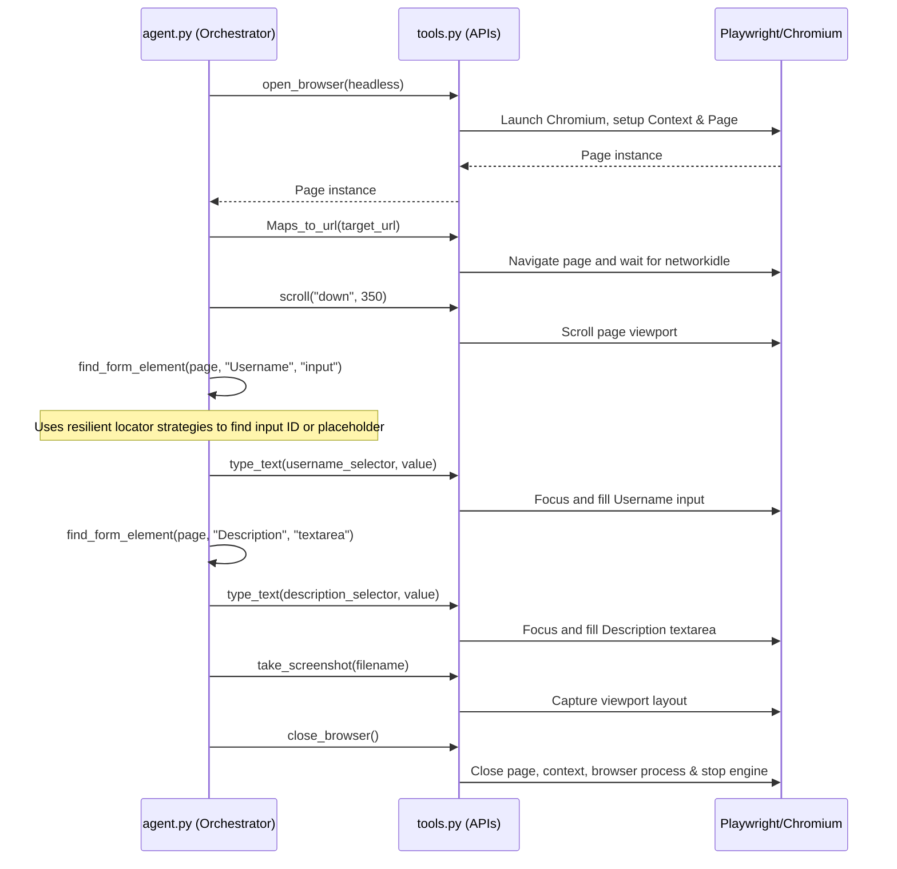

# Project Architecture Document

This document describes the architectural layout, core design decisions, workflow orchestration, and resilient elements detection strategies implemented in the Website Automation Agent.

---

## 1. Core Design Decisions

### Why Playwright (Async API)?
- **Asynchronous Execution (`asyncio`)**: Modern web scrapers and agents benefit heavily from non-blocking execution models. Playwright's native `async` API integrates directly into Python's `asyncio` loop, allowing for future extensions like concurrent page automation or parallel tool-calling pipelines without thread overhead.
- **Auto-Wait Engine**: Unlike Selenium, which requires manual sleep polling or complex explicit wait boilerplate, Playwright automatically waits for elements to be actionable (visible, stable, enabled) before performing clicks or key presses, dramatically reducing test flakiness.
- **Shadow DOM Support**: Playwright pierces Shadow DOMs out of the box, which is vital when interacting with modern UI components or web components.

### Modular Tool-Based Architecture
We separated the application into three decoupled layers:
1. **Configuration Layer (`config.py`)**: Centralizes log formats, paths, and environment settings. Decouples settings from execution code.
2. **Low-level Tool APIs (`tools.py`)**: Implements specific browser interactions (`open_browser`, `click_on_screen`, `type_text`, `scroll`, etc.) without managing task logic or selector resolution. State management is wrapped in a unified `BrowserStateManager` to prevent resource leaks.
3. **Cognitive Agent Layer (`agent.py`)**: Coordinates the page automation workflow, handles layout/label matching heuristics, and executes errors/cleanup routing.

---

## 2. Agent Workflow Orchestration

Below is the execution flow of the agent:

---

## 3. Resilient Element Detection Strategy

In modern styling frameworks (TailwindCSS, CSS modules, CSS-in-JS), classes are often compiled dynamically (e.g., `flex h-10 w-full rounded-md ...`), and IDs are automatically generated at build time (e.g., `:r3:-form-item`). Targeting these elements using fixed XPath positions or fragile class selectors breaks the script as soon as the site compiles a new build.

To resolve this, our agent implements a **Multi-Strategy Selector Fallback Heuristic** (`find_form_element`):

1. **Semantic Accessibility Linkage**: 
   Iterates through all `<label>` tags on the page. If a label matches the target text (e.g., "Username"), the script reads the label's `for` attribute (which maps to the target input's generated HTML `id`) and returns the ID selector (e.g., `#form-rhf-input-username`).
2. **DOM Container Proximity Search**:
   If the label has no explicit `for` attribute, the script locates the DOM container element surrounding the target label (e.g., a containing `div`), then searches internally for child `input` or `textarea` tags to target.
3. **Placeholder Matching**:
   Falls back to targeting tags with attributes matching common placeholder variants (e.g., `input[placeholder*="shadcn"]`).
4. **Attribute Tag Matching**:
   Performs partial matches against generic HTML input attributes like `name` or `id`.

---

## 4. Graceful Error Handling & Lifecycle Management

- **Centralized Safe Teardown**: The state manager class (`BrowserStateManager`) tracks all running instances (Playwright engine, browser instance, context, page).
- **Try-Except-Finally Safety Block**: The agent wraps the entire workflow inside a global try-except block. The `finally` segment guarantees that `tools.close_browser()` executes under all conditions (timeouts, selector exceptions, or network failures). This prevents orphaned browser processes from running in the background and consuming host resources.
